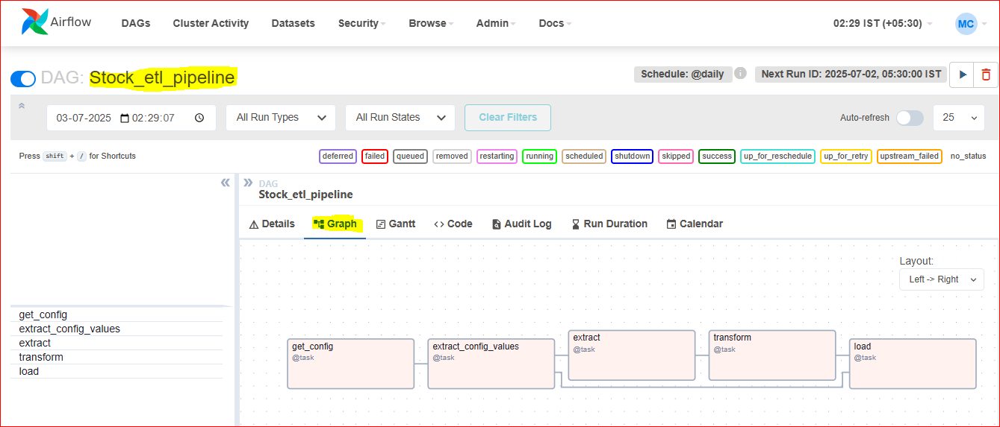
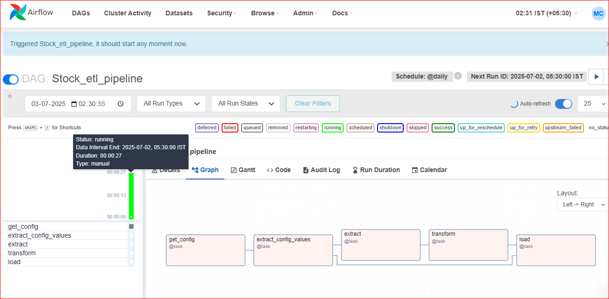
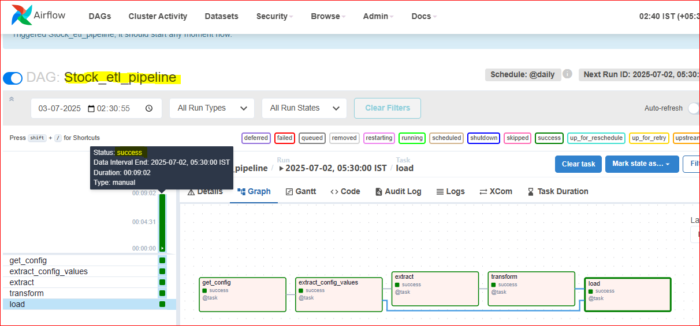
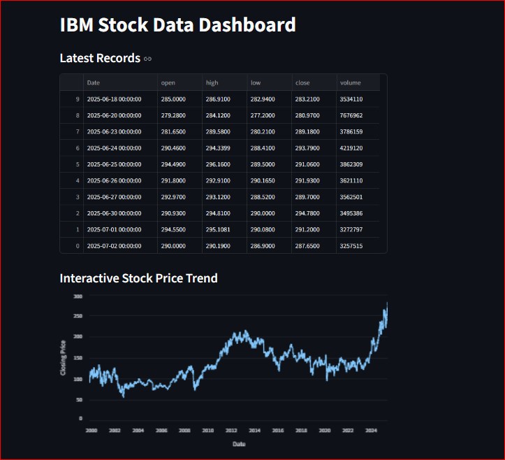

# 📈 Stock ETL Pipeline with Airflow, MongoDB & Streamlit

This project demonstrates a modular, production-style **ETL pipeline** for stock market data using:

- **Apache Airflow** for orchestration  
- **MongoDB** for storage  
- **Streamlit** for visualization

---

## 🚀 Features

- Modularized ETL design (Extract, Transform, Load)
- DAG-based orchestration via Apache Airflow
- Secrets/config handled via external JSON
- Raw & processed data stored in MongoDB
- Streamlit dashboard for visualization
- Real-world reproducible structure

---

## 📦 Tech Stack

- Python 3.10  
- Apache Airflow  
- MongoDB  
- Streamlit  
- JSON (for config)  

---

## 📁 Project Structure

```
stock-etl-pipeline/
│
├── dags/
│   └── etl_stock_pipeline.py        # Airflow DAG definition
│
├── stock_etl_model/
│   ├── extract_stage.py             # Extract stage logic
│   ├── transform_stage.py           # Transform stage logic
│   └── load_stage.py                # Load stage logic
│
├── output/                          # Screenshots of ETL & dashboard
│
├── streamlit_app.py                 # Streamlit visualization
├── password.json                    # Secrets (excluded from Git)
└── README.md                        # Project description
```

---

## 🔁 DAG Overview

Workflow in Airflow DAG:

```text
1. get_config → reads secret config
2. extract_config_values → parses necessary keys
3. extract → calls API with credentials
4. transform → processes data
5. load → inserts data into MongoDB
```

---

## 🖼️ Screenshots

| Airflow DAG | DAG Triggered |
|-------------|----------------|
|  |  |

| All Tasks Completed | MongoDB Output |
|---------------------|----------------|
|  |  |

| Streamlit Preview |
|-------------------|
|  |

---

## 📊 Streamlit Dashboard

Launch the dashboard locally:

```bash
streamlit run streamlit_app.py
```

---

## 🔐 Config File Format (`password.json`)

This file is required but should not be pushed to GitHub. Example:

```json
{
  "symbol": "IBM",
  "password": "your_api_key",
  "mongo_uri": "mongodb://localhost:27017",
  "db_name": "stock_data",
  "collection_name": "ibm_data"
}
```

---

## 🧠 Learnings

- Designed a real-time ETL flow from scratch  
- Handled Airflow task dependencies using `XCom`  
- Managed configs securely outside of DAG  
- Created an interactive dashboard with Streamlit  
- Simulated a production-ready pipeline  

---

## 👤 Author

**Mithilesh Chaurasiya**    
🔗 [Portfolio](https://mithileshcv.up.railway.app)  
🔗 [LinkedIn](https://linkedin.com/in/mithilesh1627)

---

## 🌟 Star the Repo

If this project helped you understand real-world Airflow-based pipelines, consider giving it a ⭐ on GitHub!
